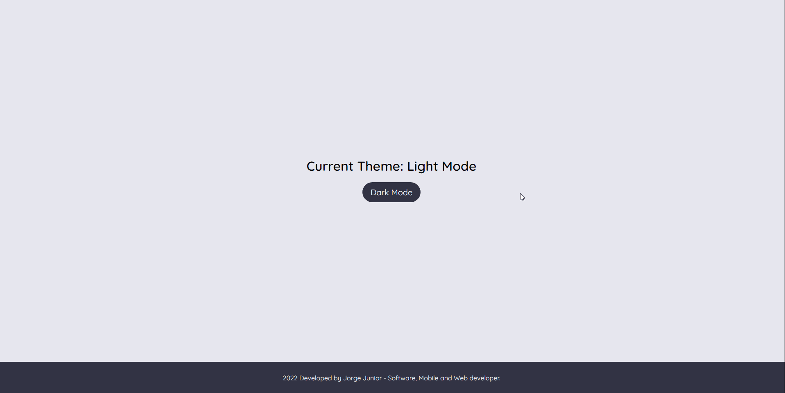

# Manipulando DOM com javascript

## Descrição

Projeto de manipulação de elementos do DOM sem uso de Frameworks ou Bibliotecas, simulando somente uma página com a opção de ativar/desativar tema escuro.

## Tecnologias

## Demonstração

